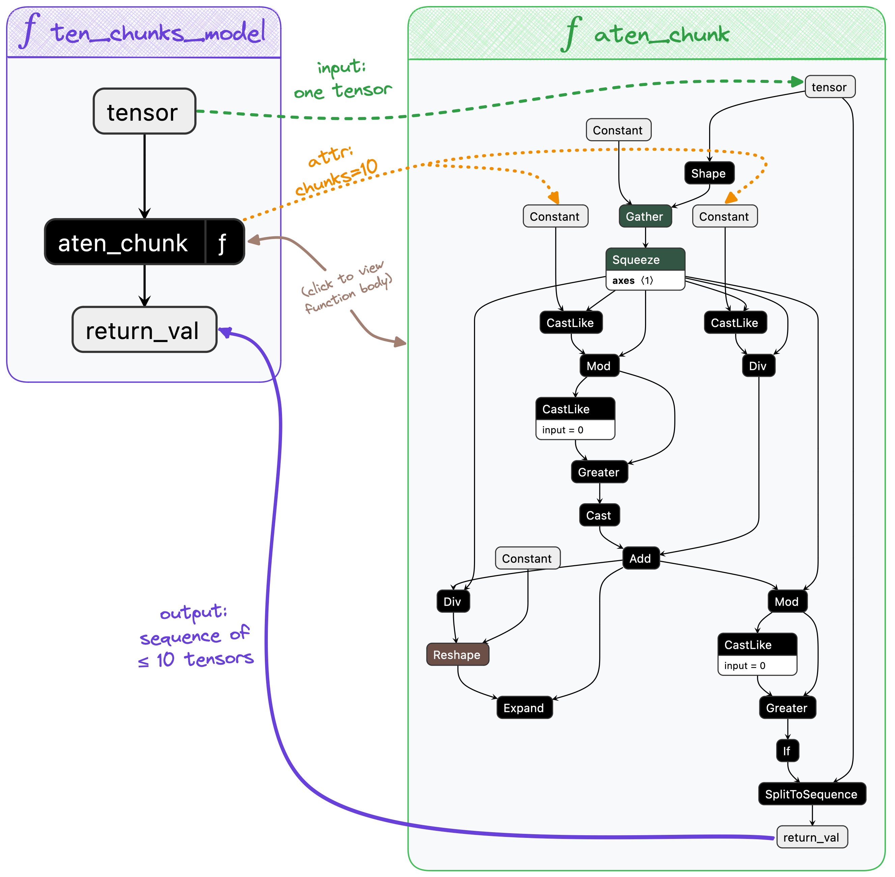

# Introducing ONNX Script: authoring ONNX with the ease of Python

<div class="article-meta article-authors">
    <svg xmlns="http://www.w3.org/2000/svg" width="16" height="16" fill="currentColor" class="bi bi-people" viewBox="0 0 16 16">
        <path d="M15 14s1 0 1-1-1-4-5-4-5 3-5 4 1 1 1 1h8Zm-7.978-1A.261.261 0 0 1 7 12.996c.001-.264.167-1.03.76-1.72C8.312 10.629 9.282 10 11 10c1.717 0 2.687.63 3.24 1.276.593.69.758 1.457.76 1.72l-.008.002a.274.274 0 0 1-.014.002H7.022ZM11 7a2 2 0 1 0 0-4 2 2 0 0 0 0 4Zm3-2a3 3 0 1 1-6 0 3 3 0 0 1 6 0ZM6.936 9.28a5.88 5.88 0 0 0-1.23-.247A7.35 7.35 0 0 0 5 9c-4 0-5 3-5 4 0 .667.333 1 1 1h4.216A2.238 2.238 0 0 1 5 13c0-1.01.377-2.042 1.09-2.904.243-.294.526-.569.846-.816ZM4.92 10A5.493 5.493 0 0 0 4 13H1c0-.26.164-1.03.76-1.724.545-.636 1.492-1.256 3.16-1.275ZM1.5 5.5a3 3 0 1 1 6 0 3 3 0 0 1-6 0Zm3-2a2 2 0 1 0 0 4 2 2 0 0 0 0-4Z"></path>
    </svg>
    <ul>
        <li>Aaron Bockover</li>
        <li>Maanav Dalal</li>
        <li>Ganesan Ramalingam</li>
        <li>Justin Chu</li>
    </ul>
</div>
<div class="article-meta article-date">
    <svg xmlns="http://www.w3.org/2000/svg" width="16" height="16" fill="currentColor" class="bi bi-calendar-date" viewBox="0 0 16 16">
        <path d="M3.5 0a.5.5 0 0 1 .5.5V1h8V.5a.5.5 0 0 1 1 0V1h1a2 2 0 0 1 2 2v11a2 2 0 0 1-2 2H2a2 2 0 0 1-2-2V3a2 2 0 0 1 2-2h1V.5a.5.5 0 0 1 .5-.5zM1 4v10a1 1 0 0 0 1 1h12a1 1 0 0 0 1-1V4H1z"></path>
        <text x="50%" y="50%" dy="2px" dominant-baseline="middle" text-anchor="middle" font-size="8px" font-weight="normal" font-family="sans-serif">20</text>
    </svg>
    <span class="date">June 20, 2023</span>
</div>

## An ONNX Refresher
ONNX models are flexible, standardized representations of machine learning that allow them to be executed across a gamut of hardware platforms and runtime environments from large scale cloud-based super computers to resource-constrained edge devices such as your web browser and phone.

Typically, machine learning models are developed using higher level frameworks such as [PyTorch][torch-onnx] and [TensorFlow][tensorflow-onnx]. While these frameworks tend to be productive for iterating on the development of models, the models are not typically deployed to production in this fashion. Instead, they are exported to ONNX by facilities provided by the frameworks, and then optimized for a particular target by tools such as [Olive][olive].

Beyond its graph format, canonically represented using [Protobuf][protobuf], ONNX consists of a standard set of primitive operators which are implemented by runtimes and hardware vendors alike. With this broad ecosystem in mind, ONNX aims to keep the number of these operators low, encouraging composability through ONNX functions. This is important to reduce the overhead of supporting ONNX.

## Announcing ONNX Script
[ONNX Script][onnxscript-github] is a new open-source library for directly authoring ONNX models in Python with a focus on _clean, idiomatic Python_ syntax and composability through ONNX-native functions. Critically, it is also the foundation upon which we are building the new PyTorch ONNX exporter to support [TorchDynamo][torch-dynamo] – the future of PyTorch.

Prior to ONNX Script, authoring ONNX models required deep knowledge of the specification and serialization format itself. While eventually a more convenient [helper API][onnx-helper-api] was introduced that largely abstracted the serialization format, it still required deep familiarity with ONNX constructs.

ONNX Script takes a new approach by integrating deeply with Python on two fronts: first, it provides a strongly typed API for all operators in ONNX (all 186 as of opset 19). This allows existing Python tooling, linters, and IDEs to provide valuable feedback and enforce correctness. Second, ONNX Script supports idiomatic Python language constructs to make authoring ONNX more natural, including support for conditionals and loops, binary and unary operators, subscripting, slicing, and more. For example, the expression `a + b` in Python would translate to the ONNX operator `Add(a, b)`.

Let's look at how we might implement GELU using ONNX Script and compare with `onnx.helper` API; and to be clear, the examples below produce the same ONNX model. For reference, we'll use this definition of GELU to guide the ONNX implementations:

<figure class="math">
<svg xmlns="http://www.w3.org/2000/svg" width="100%" height="auto" viewBox="0 -1342 19081.3 2028" xmlns:xlink="http://www.w3.org/1999/xlink" aria-hidden="true" style=""><defs><path id="MJX-7-TEX-N-47" d="M56 342Q56 428 89 500T174 615T283 681T391 705Q394 705 400 705T408 704Q499 704 569 636L582 624L612 663Q639 700 643 704Q644 704 647 704T653 705H657Q660 705 666 699V419L660 413H626Q620 419 619 430Q610 512 571 572T476 651Q457 658 426 658Q401 658 376 654T316 633T254 592T205 519T177 411Q173 369 173 335Q173 259 192 201T238 111T302 58T370 31T431 24Q478 24 513 45T559 100Q562 110 562 160V212Q561 213 557 216T551 220T542 223T526 225T502 226T463 227H437V273H449L609 270Q715 270 727 273H735V227H721Q674 227 668 215Q666 211 666 108V6Q660 0 657 0Q653 0 639 10Q617 25 600 42L587 54Q571 27 524 3T406 -22Q317 -22 238 22T108 151T56 342Z"></path><path id="MJX-7-TEX-N-45" d="M128 619Q121 626 117 628T101 631T58 634H25V680H597V676Q599 670 611 560T625 444V440H585V444Q584 447 582 465Q578 500 570 526T553 571T528 601T498 619T457 629T411 633T353 634Q266 634 251 633T233 622Q233 622 233 621Q232 619 232 497V376H286Q359 378 377 385Q413 401 416 469Q416 471 416 473V493H456V213H416V233Q415 268 408 288T383 317T349 328T297 330Q290 330 286 330H232V196V114Q232 57 237 52Q243 47 289 47H340H391Q428 47 452 50T505 62T552 92T584 146Q594 172 599 200T607 247T612 270V273H652V270Q651 267 632 137T610 3V0H25V46H58Q100 47 109 49T128 61V619Z"></path><path id="MJX-7-TEX-N-4C" d="M128 622Q121 629 117 631T101 634T58 637H25V683H36Q48 680 182 680Q324 680 348 683H360V637H333Q273 637 258 635T233 622L232 342V129Q232 57 237 52Q243 47 313 47Q384 47 410 53Q470 70 498 110T536 221Q536 226 537 238T540 261T542 272T562 273H582V268Q580 265 568 137T554 5V0H25V46H58Q100 47 109 49T128 61V622Z"></path><path id="MJX-7-TEX-N-55" d="M128 622Q121 629 117 631T101 634T58 637H25V683H36Q57 680 180 680Q315 680 324 683H335V637H302Q262 636 251 634T233 622L232 418V291Q232 189 240 145T280 67Q325 24 389 24Q454 24 506 64T571 183Q575 206 575 410V598Q569 608 565 613T541 627T489 637H472V683H481Q496 680 598 680T715 683H724V637H707Q634 633 622 598L621 399Q620 194 617 180Q617 179 615 171Q595 83 531 31T389 -22Q304 -22 226 33T130 192Q129 201 128 412V622Z"></path><path id="MJX-7-TEX-N-28" d="M94 250Q94 319 104 381T127 488T164 576T202 643T244 695T277 729T302 750H315H319Q333 750 333 741Q333 738 316 720T275 667T226 581T184 443T167 250T184 58T225 -81T274 -167T316 -220T333 -241Q333 -250 318 -250H315H302L274 -226Q180 -141 137 -14T94 250Z"></path><path id="MJX-7-TEX-I-1D465" d="M52 289Q59 331 106 386T222 442Q257 442 286 424T329 379Q371 442 430 442Q467 442 494 420T522 361Q522 332 508 314T481 292T458 288Q439 288 427 299T415 328Q415 374 465 391Q454 404 425 404Q412 404 406 402Q368 386 350 336Q290 115 290 78Q290 50 306 38T341 26Q378 26 414 59T463 140Q466 150 469 151T485 153H489Q504 153 504 145Q504 144 502 134Q486 77 440 33T333 -11Q263 -11 227 52Q186 -10 133 -10H127Q78 -10 57 16T35 71Q35 103 54 123T99 143Q142 143 142 101Q142 81 130 66T107 46T94 41L91 40Q91 39 97 36T113 29T132 26Q168 26 194 71Q203 87 217 139T245 247T261 313Q266 340 266 352Q266 380 251 392T217 404Q177 404 142 372T93 290Q91 281 88 280T72 278H58Q52 284 52 289Z"></path><path id="MJX-7-TEX-N-29" d="M60 749L64 750Q69 750 74 750H86L114 726Q208 641 251 514T294 250Q294 182 284 119T261 12T224 -76T186 -143T145 -194T113 -227T90 -246Q87 -249 86 -250H74Q66 -250 63 -250T58 -247T55 -238Q56 -237 66 -225Q221 -64 221 250T66 725Q56 737 55 738Q55 746 60 749Z"></path><path id="MJX-7-TEX-N-3D" d="M56 347Q56 360 70 367H707Q722 359 722 347Q722 336 708 328L390 327H72Q56 332 56 347ZM56 153Q56 168 72 173H708Q722 163 722 153Q722 140 707 133H70Q56 140 56 153Z"></path><path id="MJX-7-TEX-N-3A6" d="M312 622Q310 623 307 625T303 629T297 631T286 634T270 635T246 636T211 637H184V683H196Q220 680 361 680T526 683H538V637H511Q468 637 447 635T422 631T411 622V533L425 531Q525 519 595 466T665 342Q665 301 642 267T583 209T506 172T425 152L411 150V61Q417 55 421 53T447 48T511 46H538V0H526Q502 3 361 3T196 0H184V46H211Q231 46 245 46T270 47T286 48T297 51T303 54T307 57T312 61V150H310Q309 151 289 153T232 166T160 195Q149 201 136 210T103 238T69 284T56 342Q56 414 128 467T294 530Q309 532 310 533H312V622ZM170 342Q170 207 307 188H312V495H309Q301 495 282 491T231 469T186 423Q170 389 170 342ZM415 188Q487 199 519 236T551 342Q551 384 539 414T507 459T470 481T434 491T415 495H410V188H415Z"></path><path id="MJX-7-TEX-N-22C5" d="M78 250Q78 274 95 292T138 310Q162 310 180 294T199 251Q199 226 182 208T139 190T96 207T78 250Z"></path><path id="MJX-7-TEX-N-31" d="M213 578L200 573Q186 568 160 563T102 556H83V602H102Q149 604 189 617T245 641T273 663Q275 666 285 666Q294 666 302 660V361L303 61Q310 54 315 52T339 48T401 46H427V0H416Q395 3 257 3Q121 3 100 0H88V46H114Q136 46 152 46T177 47T193 50T201 52T207 57T213 61V578Z"></path><path id="MJX-7-TEX-N-32" d="M109 429Q82 429 66 447T50 491Q50 562 103 614T235 666Q326 666 387 610T449 465Q449 422 429 383T381 315T301 241Q265 210 201 149L142 93L218 92Q375 92 385 97Q392 99 409 186V189H449V186Q448 183 436 95T421 3V0H50V19V31Q50 38 56 46T86 81Q115 113 136 137Q145 147 170 174T204 211T233 244T261 278T284 308T305 340T320 369T333 401T340 431T343 464Q343 527 309 573T212 619Q179 619 154 602T119 569T109 550Q109 549 114 549Q132 549 151 535T170 489Q170 464 154 447T109 429Z"></path><path id="MJX-7-TEX-LO-5B" d="M224 -649V1150H455V1099H275V-598H455V-649H224Z"></path><path id="MJX-7-TEX-N-2B" d="M56 237T56 250T70 270H369V420L370 570Q380 583 389 583Q402 583 409 568V270H707Q722 262 722 250T707 230H409V-68Q401 -82 391 -82H389H387Q375 -82 369 -68V230H70Q56 237 56 250Z"></path><path id="MJX-7-TEX-N-65" d="M28 218Q28 273 48 318T98 391T163 433T229 448Q282 448 320 430T378 380T406 316T415 245Q415 238 408 231H126V216Q126 68 226 36Q246 30 270 30Q312 30 342 62Q359 79 369 104L379 128Q382 131 395 131H398Q415 131 415 121Q415 117 412 108Q393 53 349 21T250 -11Q155 -11 92 58T28 218ZM333 275Q322 403 238 411H236Q228 411 220 410T195 402T166 381T143 340T127 274V267H333V275Z"></path><path id="MJX-7-TEX-N-72" d="M36 46H50Q89 46 97 60V68Q97 77 97 91T98 122T98 161T98 203Q98 234 98 269T98 328L97 351Q94 370 83 376T38 385H20V408Q20 431 22 431L32 432Q42 433 60 434T96 436Q112 437 131 438T160 441T171 442H174V373Q213 441 271 441H277Q322 441 343 419T364 373Q364 352 351 337T313 322Q288 322 276 338T263 372Q263 381 265 388T270 400T273 405Q271 407 250 401Q234 393 226 386Q179 341 179 207V154Q179 141 179 127T179 101T180 81T180 66V61Q181 59 183 57T188 54T193 51T200 49T207 48T216 47T225 47T235 46T245 46H276V0H267Q249 3 140 3Q37 3 28 0H20V46H36Z"></path><path id="MJX-7-TEX-N-66" d="M273 0Q255 3 146 3Q43 3 34 0H26V46H42Q70 46 91 49Q99 52 103 60Q104 62 104 224V385H33V431H104V497L105 564L107 574Q126 639 171 668T266 704Q267 704 275 704T289 705Q330 702 351 679T372 627Q372 604 358 590T321 576T284 590T270 627Q270 647 288 667H284Q280 668 273 668Q245 668 223 647T189 592Q183 572 182 497V431H293V385H185V225Q185 63 186 61T189 57T194 54T199 51T206 49T213 48T222 47T231 47T241 46T251 46H282V0H273Z"></path><path id="MJX-7-TEX-N-2F" d="M423 750Q432 750 438 744T444 730Q444 725 271 248T92 -240Q85 -250 75 -250Q68 -250 62 -245T56 -231Q56 -221 230 257T407 740Q411 750 423 750Z"></path><path id="MJX-7-TEX-N-221A" d="M95 178Q89 178 81 186T72 200T103 230T169 280T207 309Q209 311 212 311H213Q219 311 227 294T281 177Q300 134 312 108L397 -77Q398 -77 501 136T707 565T814 786Q820 800 834 800Q841 800 846 794T853 782V776L620 293L385 -193Q381 -200 366 -200Q357 -200 354 -197Q352 -195 256 15L160 225L144 214Q129 202 113 190T95 178Z"></path><path id="MJX-7-TEX-LO-5D" d="M16 1099V1150H247V-649H16V-598H196V1099H16Z"></path></defs><g stroke="currentColor" fill="currentColor" stroke-width="0" transform="scale(1,-1)"><g data-mml-node="math"><g data-mml-node="mtext"><use data-c="47" xlink:href="#MJX-7-TEX-N-47"></use><use data-c="45" xlink:href="#MJX-7-TEX-N-45" transform="translate(785,0)"></use><use data-c="4C" xlink:href="#MJX-7-TEX-N-4C" transform="translate(1466,0)"></use><use data-c="55" xlink:href="#MJX-7-TEX-N-55" transform="translate(2091,0)"></use></g><g data-mml-node="mrow" transform="translate(3007.7,0)"><g data-mml-node="mo"><use data-c="28" xlink:href="#MJX-7-TEX-N-28"></use></g><g data-mml-node="mi" transform="translate(389,0)"><use data-c="1D465" xlink:href="#MJX-7-TEX-I-1D465"></use></g><g data-mml-node="mo" transform="translate(961,0)"><use data-c="29" xlink:href="#MJX-7-TEX-N-29"></use></g></g><g data-mml-node="mo" transform="translate(4635.4,0)"><use data-c="3D" xlink:href="#MJX-7-TEX-N-3D"></use></g><g data-mml-node="mi" transform="translate(5691.2,0)"><use data-c="1D465" xlink:href="#MJX-7-TEX-I-1D465"></use></g><g data-mml-node="mi" transform="translate(6263.2,0)"><use data-c="3A6" xlink:href="#MJX-7-TEX-N-3A6"></use></g><g data-mml-node="mrow" transform="translate(7151.9,0)"><g data-mml-node="mo"><use data-c="28" xlink:href="#MJX-7-TEX-N-28"></use></g><g data-mml-node="mi" transform="translate(389,0)"><use data-c="1D465" xlink:href="#MJX-7-TEX-I-1D465"></use></g><g data-mml-node="mo" transform="translate(961,0)"><use data-c="29" xlink:href="#MJX-7-TEX-N-29"></use></g></g><g data-mml-node="mo" transform="translate(8779.7,0)"><use data-c="3D" xlink:href="#MJX-7-TEX-N-3D"></use></g><g data-mml-node="mi" transform="translate(9835.4,0)"><use data-c="1D465" xlink:href="#MJX-7-TEX-I-1D465"></use></g><g data-mml-node="mo" transform="translate(10629.7,0)"><use data-c="22C5" xlink:href="#MJX-7-TEX-N-22C5"></use></g><g data-mml-node="mfrac" transform="translate(11129.9,0)"><g data-mml-node="mn" transform="translate(220,676)"><use data-c="31" xlink:href="#MJX-7-TEX-N-31"></use></g><g data-mml-node="mn" transform="translate(220,-686)"><use data-c="32" xlink:href="#MJX-7-TEX-N-32"></use></g><rect width="700" height="60" x="120" y="220"></rect></g><g data-mml-node="mrow" transform="translate(12069.9,0)"><g data-mml-node="mo" transform="translate(0 -0.5)"><use data-c="5B" xlink:href="#MJX-7-TEX-LO-5B"></use></g><g data-mml-node="mn" transform="translate(472,0)"><use data-c="31" xlink:href="#MJX-7-TEX-N-31"></use></g><g data-mml-node="mo" transform="translate(1194.2,0)"><use data-c="2B" xlink:href="#MJX-7-TEX-N-2B"></use></g><g data-mml-node="mtext" transform="translate(2194.4,0)"><use data-c="65" xlink:href="#MJX-7-TEX-N-65"></use><use data-c="72" xlink:href="#MJX-7-TEX-N-72" transform="translate(444,0)"></use><use data-c="66" xlink:href="#MJX-7-TEX-N-66" transform="translate(836,0)"></use></g><g data-mml-node="mo" transform="translate(3336.4,0)"><use data-c="28" xlink:href="#MJX-7-TEX-N-28"></use></g><g data-mml-node="mi" transform="translate(3725.4,0)"><use data-c="1D465" xlink:href="#MJX-7-TEX-I-1D465"></use></g><g data-mml-node="TeXAtom" data-mjx-texclass="ORD" transform="translate(4297.4,0)"><g data-mml-node="mo"><use data-c="2F" xlink:href="#MJX-7-TEX-N-2F"></use></g></g><g data-mml-node="msqrt" transform="translate(4797.4,0)"><g transform="translate(853,0)"><g data-mml-node="mn"><use data-c="32" xlink:href="#MJX-7-TEX-N-32"></use></g></g><g data-mml-node="mo" transform="translate(0,148.3)"><use data-c="221A" xlink:href="#MJX-7-TEX-N-221A"></use></g><rect width="500" height="60" x="853" y="888.3"></rect></g><g data-mml-node="mo" transform="translate(6150.4,0)"><use data-c="29" xlink:href="#MJX-7-TEX-N-29"></use></g><g data-mml-node="mo" transform="translate(6539.4,0) translate(0 -0.5)"><use data-c="5D" xlink:href="#MJX-7-TEX-LO-5D"></use></g></g></g></g></svg>
</figure>

<h4 class="code-title">GELU in ONNX Script</h4>

```python
import math
from onnxscript import (
    script, opset18 as op, FLOAT
)

M_SQRT1_2 = math.sqrt(0.5)

@script()
def gelu(X: FLOAT[...]):
    phiX = 0.5 * (op.Erf(M_SQRT1_2 * X) + 1.0)
    return X * phiX

gelu_model = gelu.to_model_proto()
```

<h4 class="code-title">GELU with the ONNX Helper API</h4>

{.longcode}
```python
# Note: the code is long enough that you'll need
# to scroll the view to read it all ¯\_(ツ)_/¯

import math
import onnx
import onnx.helper

gelu_model = onnx.helper.make_model(
    ir_version=8,
    opset_imports=[onnx.helper.make_operatorsetid("", 18)],
    graph=onnx.helper.make_graph(
        name="Gelu",
        nodes=[
            onnx.helper.make_node(
                "Constant",
                inputs=[],
                outputs=["tmp"],
                name="n0",
                value=onnx.helper.make_tensor(
                    "tmp", onnx.TensorProto.FLOAT, dims=[], vals=[0.5]
                ),
            ),
            onnx.helper.make_node(
                "Constant",
                inputs=[],
                outputs=["M_SQRT1_2"],
                name="n1",
                value=onnx.helper.make_tensor(
                    "M_SQRT1_2",
                    onnx.TensorProto.FLOAT,
                    dims=[],
                    vals=[math.sqrt(0.5)],
                ),
            ),
            onnx.helper.make_node(
                "CastLike",
                inputs=["M_SQRT1_2", "X"],
                outputs=["M_SQRT1_2_cast"],
                name="n2",
            ),
            onnx.helper.make_node(
                "Mul",
                inputs=["M_SQRT1_2_cast", "X"],
                outputs=["tmp_0"],
                name="n3",
            ),
            onnx.helper.make_node(
                "Erf", inputs=["tmp_0"], outputs=["tmp_1"], name="n4"
            ),
            onnx.helper.make_node(
                "Constant",
                inputs=[],
                outputs=["tmp_2"],
                name="n5",
                value=onnx.helper.make_tensor(
                    "tmp_2",
                    onnx.TensorProto.FLOAT,
                    dims=[],
                    vals=[1.0],
                ),
            ),
            onnx.helper.make_node(
                "CastLike",
                inputs=["tmp_2", "tmp_1"],
                outputs=["tmp_2_cast"],
                name="n6",
            ),
            onnx.helper.make_node(
                "Add",
                inputs=["tmp_1", "tmp_2_cast"],
                outputs=["tmp_3"],
                name="n7",
            ),
            onnx.helper.make_node(
                "CastLike",
                inputs=["tmp", "tmp_3"],
                outputs=["tmp_cast"],
                name="n8",
            ),
            onnx.helper.make_node(
                "Mul",
                inputs=["tmp_cast", "tmp_3"],
                outputs=["phiX"],
                name="n9",
            ),
            onnx.helper.make_node(
                "Mul",
                inputs=["X", "phiX"],
                outputs=["return_val"],
                name="n10",
            ),
        ],
        inputs=[
            onnx.helper.make_value_info(
                name="X",
                type_proto=onnx.helper.make_tensor_type_proto(
                    elem_type=onnx.TensorProto.FLOAT, shape=[]
                ),
            )
        ],
        outputs=[
            onnx.helper.make_value_info(
                name="return_val",
                type_proto=onnx.helper.make_tensor_type_proto(
                    elem_type=onnx.TensorProto.FLOAT, shape=[]
                ),
            )
        ],
    ),
)
```

As you can see, ONNX Script emphasizes the familiar readability and productivity of Python while expressing an ONNX model that can be statically reasoned about by existing Python and ONNX tooling.

This also means ONNX comes alive within the context of your existing tooling and development environments, be it debugging in Visual Studio Code or demonstrating concepts in a Jupyter Notebook &mdash; ONNX Script integrates naturally.

## Why are we investing in ONNX Script?
Much has changed since ONNX support for PyTorch was originally introduced over five years ago in PyTorch 0.3.0. For PyTorch 2.0, TorchDynamo represents the eventual deprecation of TorchScript, which implies a major overhaul of the ONNX exporter is necessary. We are fully embracing this as an opportunity to revisit the fundamentals upon which the exporter is built, and ONNX Script is its new foundation. We began this effort in November of last year and have worked closely with PyTorch engineers to ensure TorchDynamo is a fully capable starting point for exporting high fidelity ONNX for years to come.

One of the first streams of work we started was the development of what we call Torchlib, a pure ONNX implementation of the operators in PyTorch – namely [Core ATen IR and Prims IR][torch-ir]; and of course, these operators are implemented in ONNX Script! This approach greatly simplifies the central responsibility of the exporter as it &ldquo;just&rdquo; needs to project FX graph nodes produced by TorchDynamo into ONNX graph nodes, without concerning itself with the implementation details of individual operators.

We will cover the new PyTorch ONNX exporter in a separate post with more depth as PyTorch 2.1 approaches, but for now the key takeaway is that ONNX Script is pervasive throughout our renewed approach. For those willing to try bold new things, the new exporter is available as a preview in PyTorch nightly via the [`torch.onnx.dynamo_export`][torch-onnx-dynamoexport] API.

By deeply weaving ONNX Script support into the PyTorch ONNX exporter, we have also made it possible to augment PyTorch model code with specialized ONNX functions as custom operators. We introduced initial support for this in the TorchScript exporter starting with [PyTorch 1.13][torch-onnx-customops] and continue to refine this capability in the new exporter.

## An End-to-End Example
Let’s look at an example slightly more complicated than GELU. In fact, the following example is adapted directly from the new PyTorch ONNX exporter, implementing support for [`torch.chunk`][torch-chunk], which attempts to split a tensor into the number of specified chunks.

```python
from typing import Sequence
from onnxscript import opset18 as op, script, FLOAT, INT64

@script()
def aten_chunk(
    tensor: FLOAT[...], chunks: int, dim: int = 0,
) -> Sequence[FLOAT[...]]:
    neg_1 = op.Constant(value_ints=[-1])

    # Get size of specified dim
    dim_size = op.Shape(tensor)[dim]

    # Compute size/chunk to get the number of data in one chunk
    num_per_chunk = dim_size / chunks + op.Cast(dim_size % chunks > 0, to=INT64.dtype)

    # Compute real chunk number
    num_chunk = dim_size / num_per_chunk

    # Get something like [n, n, n, n, ...], total num_chunk
    list_split = op.Expand(num_per_chunk, op.Reshape(num_chunk, neg_1))

    remainder = dim_size % num_per_chunk
    if remainder > 0:
        # Append the remainder to the [n, n, n, n, ..., r]
        list_split = op.Concat(list_split, op.Reshape(remainder, neg_1), axis=0)

    return op.SplitToSequence(tensor, list_split, axis=dim)
```

We start by importing from onnxscript the ONNX opset we wish to use (version 18 in this case), the `@script` decorator, and the tensor types of `FLOAT` and `INT64`. In ONNX Script, tensor shapes are denoted by subscripting the type, such as `FLOAT[2, 10]`, symbolically such as `FLOAT["M", "N"]`, or `FLOAT[...]` in case the tensor shape is unknown. Without subscripting (just `FLOAT`), the type is intended to indicate a scalar (a tensor of rank 0).

Next, we define the `aten_chunk` function with type annotations and implement the body of the function using both built-in Python syntax and explicit invocations of ONNX operators. The example uses various binary expressions and an `if` statement, but many other idiomatic Python constructs are also supported.

We also need to define a simple model that calls our ONNX Script function so we can export and verify an end-to-end example:

```python
@script()
def ten_chunks_model(tensor: FLOAT["M"]):
    return aten_chunk(tensor, chunks=10)
```

This model will simply split the provided tensor into ten tensors, but it also demonstrates that ONNX functions can of course call other ONNX functions, not just built-in ONNX operators.

We’ll now export our ONNX Script model to ONNX and explore it in [Netron][netron]. Functions decorated with `@script` allow them to be exported using the `to_model_proto` function.

```python
import onnx
onnx.save_model(
    ten_chunks_model.to_model_proto(),
    "ten_chunks_model.onnx",
)
```

If we open _ten_chunks_model.onnx_ in Netron, we can observe the composability of ONNX functions and how the Python code was translated into an ONNX model.

[](ten_chunks_model.png)

The graphs depict our two ONNX functions; we can observe the original <span style="color:#2f9e44;text-decoration:underline;text-decoration-style:dashed;text-decoration-thickness:3px;font-weight:bold;">input tensor</span> flowing from `ten_chunks_model` into `aten_chunk` along with the <span style="color:#f08c00;text-decoration:underline;text-decoration-style:dotted;text-decoration-thickness:3px;font-weight:bold;">attribute chunks=10</span>. A <span style="color:#6741d9;;text-decoration:underline;text-decoration-style:solid;text-decoration-thickness:2px;font-weight:bold;">sequence of ≤ 10 tensors</span> is returned. As one might expect, functions in ONNX can be defined once and invoked any number of times within a model. _[Read more about core ONNX concepts][onnx-concepts]._

## Iterating &amp; Debugging
Finally, we should test our model! ONNX Script makes this easy since it provides a mechanism for eagerly evaluating the model through either [ONNX Runtime][onnx-runtime] or the new [ONNX Reference Evaluator][onnx-refeval]. Of note, ONNX Script has built-in support for [NumPy][numpy] for input and output values to ease the overhead of creating and filling tensors in ONNX.

```python
import numpy as np
tensor = np.array(range(0, 48), dtype=np.float32)
chunked_tensors = ten_chunks_model(tensor)

from pprint import pprint
pprint(tensor)
pprint(chunked_tensors)
```

```python
array([ 0.,  1.,  2.,  3.,  4.,  5.,  6.,  7.,  8.,  9., 10., 11., 12.,
       13., 14., 15., 16., 17., 18., 19., 20., 21., 22., 23., 24., 25.,
       26., 27., 28., 29., 30., 31., 32., 33., 34., 35., 36., 37., 38.,
       39., 40., 41., 42., 43., 44., 45., 46., 47.], dtype=float32)
```

```python
[array([0., 1., 2., 3., 4.], dtype=float32),
 array([5., 6., 7., 8., 9.], dtype=float32),
 array([10., 11., 12., 13., 14.], dtype=float32),
 array([15., 16., 17., 18., 19.], dtype=float32),
 array([20., 21., 22., 23., 24.], dtype=float32),
 array([25., 26., 27., 28., 29.], dtype=float32),
 array([30., 31., 32., 33., 34.], dtype=float32),
 array([35., 36., 37., 38., 39.], dtype=float32),
 array([40., 41., 42., 43., 44.], dtype=float32),
 array([45., 46., 47.], dtype=float32)]
```

Because ONNX Script’s eager mode evaluates the model on an op-by-op basis, it is conducive to debugging ONNX using standard Python tooling such as [pdb][pdb] directly or through richer IDE and editor integrations provided by Visual Studio and Visual Studio Code.

```{figure} debugging_screenshot.png
:alt: Screenshot of Visual Studio Code debugging ONNX Script

_A screenshot of Visual Studio Code debugging the model while stopped on a breakpoint to inspect the `dim_size` variable and call stack._
```

Along with debuggability, IntelliSense support is front-and-center with ONNX Script. We rely heavily on Python type annotations to enforce correctness of ONNX and to make ONNX more discoverable, including inline documentation on hover tooltips and code completion suggestions. A single click will take you to expanded online documentation in your browser as well.

```{figure} intellisense_screenshot.png
:alt: Screenshot of Visual Studio Code IntelliSense for ONNX Script

_A screenshot of Visual Studio Code displaying a hover tooltip for the ONNX [Expand operator][onnx-expand-operator] with inline documentation linking to full online documentation._
```

## What’s next for ONNX Script?
In summary, ONNX Script offers a new Python-first programming model for authoring ONNX models that integrates with the existing rich ecosystem of Python tooling and environments.

Going forward, we envision ONNX Script as a means for defining and extending ONNX itself. New core operators and higher order functions that are intended to become part of the ONNX standard could be authored in ONNX Script as well, reducing the time and effort it takes for the standard to evolve. We have proven this is a viable strategy by developing Torchlib, upon which the upcoming PyTorch Dynamo-based ONNX exporter is built.

Over the coming months, we will also support converting ONNX into ONNX Script to enable seamless editing of existing models, which can play a key role for optimization passes, but also allow for maintaining and evolving ONNX models more naturally. We also intend to propose ONNX Script for inclusion directly within the ONNX GitHub organization soon, under the Linux Foundation umbrella.

Check out ONNX Script today [on GitHub][onnxscript-github] or install with `pip install git+https://github.com/microsoft/onnxscript`. We look forward to your feedback!

Finally, a _huge thank you_ to the wonderful engineering team at Microsoft that has brought us to this point so far: _Bowen Bao, Aaron Bockover, Shubham Bhokare, Jacky Chen, Wei-Sheng Chin, Justin Chu, Thiago Crepaldi, Xavier Dupre, Liqun Fu, Xaiowu Hu, Ganesan Ramalingam, Ti-Tai Wang, Jay Zhang_.


<div style="text-align: center; opacity: 50%; font-size: 2em; padding-top: 1em">
<svg xmlns="http://www.w3.org/2000/svg" width="16" height="16" fill="currentColor" class="bi bi-code-slash" viewBox="0 0 16 16">
    <path d="M10.478 1.647a.5.5 0 1 0-.956-.294l-4 13a.5.5 0 0 0 .956.294l4-13zM4.854 4.146a.5.5 0 0 1 0 .708L1.707 8l3.147 3.146a.5.5 0 0 1-.708.708l-3.5-3.5a.5.5 0 0 1 0-.708l3.5-3.5a.5.5 0 0 1 .708 0zm6.292 0a.5.5 0 0 0 0 .708L14.293 8l-3.147 3.146a.5.5 0 0 0 .708.708l3.5-3.5a.5.5 0 0 0 0-.708l-3.5-3.5a.5.5 0 0 0-.708 0z"/>
</svg>
</div>

[protobuf]: https://onnx.ai/onnx/api/classes.html#protos
[tensorflow-onnx]: https://github.com/onnx/tensorflow-onnx
[olive]: https://onnxruntime.ai/docs/performance/olive.html
[onnx-helper-api]: https://onnx.ai/onnx/api/helper.html
[onnx-concepts]: https://onnx.ai/onnx/intro/concepts.html#input-output-node-initializer-attributes
[onnx-runtime]: https://onnxruntime.ai
[onnx-refeval]: https://onnx.ai/onnx/api/reference.html
[onnx-expand-operator]: https://onnx.ai/onnx/operators/onnx__Expand.html#expand-13
[onnxscript-pypi]: https://pypi.org/project/onnxscript
[onnxscript-github]: https://github.com/microsoft/onnxscript
[torch-onnx]: https://pytorch.org/docs/stable/onnx.html
[torch-ir]: https://pytorch.org/docs/stable/ir.html
[torch-dynamo]: https://pytorch.org/docs/stable/dynamo/index.html
[torch-onnx-dynamoexport]: https://pytorch.org/docs/main/onnx.html#preview-torch-onnx-torchdynamo-exporter
[torch-onnx-customops]: https://pytorch.org/docs/stable/onnx.html#onnx-script-functions
[torch-chunk]: https://pytorch.org/docs/stable/generated/torch.chunk.html
[netron]: https://netron.app
[numpy]: https://numpy.org
[pdb]: https://docs.python.org/3/library/pdb.html
