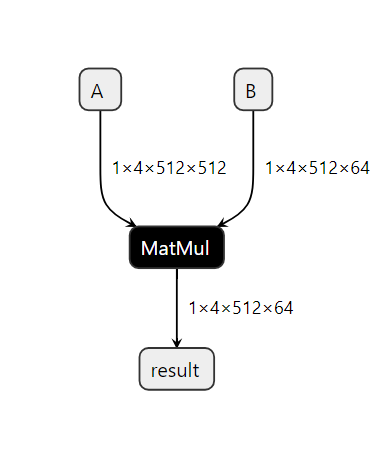

# Using the `match_condition` parameter for pattern-matching

This section talks about how to utilize the `match_condition` parameter. The `match_condition` parameter checks if the pattern matches the target pattern with certain constraints in consideration.

Let us consider a model which consists of the following pattern.

{align=center}

Based on the [ONNX Matmul spec](https://github.com/onnx/onnx/blob/main/docs/Operators.md#MatMul), onnx `Matmul` behaves like `numpy.matmul` and also follows numpy broadcasting. So in this particular pattern if matmul broadcasting is enough, then we don't need the reshapes. To validate this, we need to check the following:

1. Input shapes check: `input_a` and `input_b` should be broadcastable
2. Output shape check: `shape_c` should be the same as the output shape from the `matmul(input_a, input_b)`

If the above are true, then we don't need the reshapes and we can eliminate them using a pattern based rewrite.

First, write a target pattern and replacement pattern in a similar way to the first example.

```{literalinclude} examples/broadcast_matmul.py
:pyobject: two_reshapes_matmul_reshape_pattern
```

```{literalinclude} examples/broadcast_matmul.py
:pyobject: matmul_pattern
```

:::{note}
:name: omitting inputs in signature

The target pattern in this case has 5 inputs `input_a`, `input_b`, `shape_a`, `shape_b`, `shape_c`. However, the replacement pattern only utilizes `input_a` and `input_b`. To avoid referencing all the unused parameters in the replacement pattern signature, pass only `input_a` and `input_b` and use `**_` to represent all the unused parameters.

Similarly for writing the condition checking function, we require only `input_a`, `input_b` and `shape_c`. Use `**_` to represent all the unused parameters in the condition matching function signature.
:::

In order to validate whether matmul broadcast is sufficient, we write a condition checking function as below.
Note that the relevant inputs passed to the check function are all instances of {py:class}`onnx_ir.Value`. These represent
the values in the input graph IR that matched against the corresponding _pattern variables_ in the target
pattern. Please see documentation of the [IR API](https://onnx.ai/ir-py/) for more details on how to use it, for example to identify
the type or shape or rank of these values.

```{literalinclude} examples/broadcast_matmul.py
:pyobject: check_if_not_need_reshape
```

With all the necessary components in place, the pattern rewrite rule with the `match_condition` function is created and then the `rewriter.rewrite` is called to apply the rewrite.

```{literalinclude} examples/broadcast_matmul.py
:pyobject: apply_rewrite
```

The final graph with the applied rewrite looks as follows:

{align=center}
