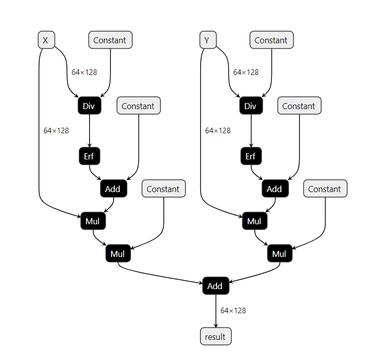
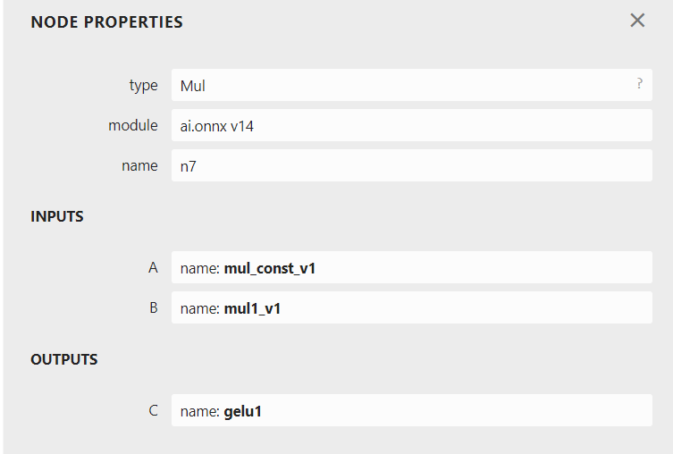
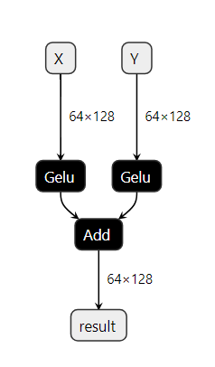

# Pattern-based Rewrite Using Rules

## Introduction

The ONNX Rewriter tool provides the user with the functionality to replace certain patterns in an ONNX graph with another pattern based on rewrite rules provided by the user.

## Usage

There are three main components needed when rewriting patterns in the graph:

1. `target_pattern` : Original pattern to match against. This pattern is written as a function using ONNXScript-like operators.
2. `replacement_pattern` : Pattern to replace the original pattern with. This pattern is also written as a function using ONNXScript-like operators.
3. `match_condition` (optional) : Pattern rewrite will occur only if the match condition is satisfied.

(heading-target-simple)=
## A Simple Example

An simple example demonstrating the usage of this functionality using the `GELU` activation function:

`GELU` activation function can be computed using a Gauss Error Function using the given formula:

```{math}
\text{GELU} = x\Phi(x) = x \cdot \frac{1}{2} [1 + \text{erf}(x / \sqrt{2})]
```

We will show how we can find a subgraph matching this computation and replace it by a call to the function.

Firstly, include all the rewriter relevant imports.

```python
from onnxscript.rewriter import pattern
from onnxscript import ir

_op = pattern.onnxop
```

Then create a target pattern that needs to be replaced using onnxscript operators.

```{literalinclude} examples/erfgelu.py
:pyobject: erf_gelu_pattern
```

After this, create a replacement pattern that consists of the GELU onnxscript operator.

```{literalinclude} examples/erfgelu.py
:pyobject: gelu
```
:::{note}
:name: type annotate ir.Value

The inputs to the replacement pattern are of type `ir.Value`. For detailed usage of `ir.Value` refer to the {py:class}`ir.Value <onnxscript.ir._core.Value>` class.
:::


For this example, we do not require a `match_condition` so that option is skipped for now. Then the rewrite rule is created using the `RewriteRule` function.

```python
rule = pattern.RewriteRule(
    erf_gelu_pattern,  # Target Pattern
    gelu,  # Replacement Pattern
)
```

Now that the rewrite rule has been created, the next step is to apply these pattern-based rewrite rules. The `rewriter.rewrite` call consists of three main components:

1. `model` : The original model on which the pattern rewrite rules are to be applied. This is of type `onnx.ModelProto`.
2. `function_rewrite_rules` : `(Optional)` This parameter is used to pass rewrite rules based on function names. Steps on how to use this parameter will be covered in a different tutorial. This parameter is of type `Sequence[type[FunctionRewriteRule]]`
3. `pattern_rewrite_rules` : `(Optional)` This parameter is used to pass rewrite rules based on a provided replacement pattern. For the purpose of this tutorial, we will be using only this parameter in conjunction with `model`. This parameter is of either one of these types:
    - `Sequence[PatternRewriteRule]`
    - `RewriteRuleSet`

:::{note}
:name: pattern_rewrite_rules input formatting

`pattern_rewrite_rules` takes a sequence of `PatternRewriteRule` types or a RewriteRuleSet which is also essentially a rule set created using a sequence of `PatternRewriteRule` types, so if only a singular rewrite rule is to be passed, it needs to passed as part of a sequence. For steps on how to create and use Rule-sets, refer to the example in the section [Creating a rule-set with different patterns](#heading-target-commute-ruleset).
:::

The snippet below below demonstrates how to use the `rewriter.rewrite` call for the rewrite rule created above:

```{literalinclude} examples/erfgelu.py
:pyobject: apply_rewrite
```

The graph (on the left) consists of the target pattern before the rewrite rule is applied. Once the rewrite rule is applied, the graph (on the right) shows that the target pattern has been successfully replaced by a GELU node as intended.

 


(heading-target-commute)=
## Utilizing `commute` parameter for pattern-matching
Extending the previous [simple example](heading-target-simple), assumming a scenario where we have a graph with the following structure.

{align=center width=500px}

In this graph, there exist two node pattern that constitute a `GELU` op. However, there is a subtle difference between the two. Focusing on the parent `Mul` nodes in either patterns, the order of the input values being multiplied is switched.

{width=330px align=left} {width=330px align=center}


If we utilize the same `target_pattern` created for the earlier [simple example](heading-target-simple) (shown below), only one of two `GELU` pattern will be matched.

```{literalinclude} examples/erfgelu.py
:pyobject: erf_gelu_pattern
```

```{image} examples/img/erfgelu_06_commute.png
:alt: The resulting graph after matching.
:width: 400px
:align: center
```

Only one of the patterns has been successfully matched and replaced by a `GELU` node. In order to rewrite both the existing patterns in the graph, there are two methods.

(heading-target-commute-ruleset)=
### 1. Creating a rule-set with different patterns.

This method requires creating two separate rules and packing them into either a sequence of `PatternRewriteRule`s or a `RewriteRuleSet`. Creating a `RewriteRuleSet` is the preferable option but either can be used. In order to create a `RewriteRuleSet` with multiple rules `rule1` and `rule2` for example:

```python
from onnxscript.rewriter import pattern
rewrite_rule_set = pattern.RewriteRuleSet(rules=[rule1, rule2])
```

In order to apply this method to the example above, first create the two separate target patterns as follows:

```{literalinclude} examples/erfgelu.py
:pyobject: erf_gelu_pattern
```
```{literalinclude} examples/erfgelu.py
:pyobject: erf_gelu_pattern_2
```

Then, create two separate `PatternRewriteRule`s, one for each target pattern. Pack these rules into a `RewriteRuleSet` object and apply rewrites by passing the created `RewriteRuleSet` for the `pattern_rewrite_rules` parameter.

```{literalinclude} examples/erfgelu.py
:pyobject: apply_rewrite_with_ruleset
```


### 2. Using the `commute` parameter while creating a rule.

Creating multiple target patterns for similar patterns can be tedious. In order to avoid this, the `commute` parameter can be utilized while creating the `RewriteRuleSet`. Simply set `commute=True` in order to avoid creating multiple target pattern for cases where patterns are different due to commutativity. Multiple rules with the different patterns emerging due to satisfying the commutativity property are automatically packed into a `RewriteRuleSet` object. Then apply rewrites by passing the created `RewriteRuleSet` for the `pattern_rewrite_rules` parameter.

```{literalinclude} examples/erfgelu.py
:pyobject: apply_rewrite_with_commute
```

For the both of the aforementioned methods, the final graph with both rewrites applied should look as follows:

{align=center width=300px}

## Using the `match_condition` parameter for pattern-matching

This section talks about how to utilize the `match_condition` parameter. The `match_condition` parameter checks if the pattern matches the target pattern with certain constraints in consideration.

Let us consider a model which consists of the following pattern.

{align=center}

Based on the [ONNX Matmul spec](https://github.com/onnx/onnx/blob/main/docs/Operators.md#MatMul), onnx `Matmul` behaves like `numpy.matmul` and also follows numpy broadcasting. So in this particular pattern if matmul broadcasting is enough, then we don't need the reshapes. To validate this, we need to check the following:

1. Input shapes check: `input_a` and `input_b` should be broadcastable
2. Output shape check: `shape_c` should be the same as the output shape from the `matmul(input_a, input_b)`

If the above are true, then we don't need the reshapes and we can eliminate them using a pattern based rewrite.

First, write a target pattern and replacement pattern in a similar way to the first example.

```{literalinclude} examples/broadcast_matmul.py
:pyobject: two_reshapes_matmul_reshape_pattern
```

```{literalinclude} examples/broadcast_matmul.py
:pyobject: matmul_pattern
```

:::{note}
:name: omitting inputs in signature

The target pattern in this case has 5 inputs `input_a`, `input_b`, `shape_a`, `shape_b`, `shape_c`. However, the replacement pattern only utilizes `input_a` and `input_b`. To avoid referencing all the unused parameters in the replacement pattern signature, pass only `input_a` and `input_b` and use `**_` to represent all the unused parameters.

Similarly for writing the condition checking function, we require only `input_a`, `input_b` and `shape_c`. Use `**_` to represent all the unused parameters in the condition matching function signature.
:::

In order to validate whether matmul broadcast is sufficient, we write a condition checking function as follows:

```{literalinclude} examples/broadcast_matmul.py
:pyobject: check_if_need_reshape
```

With all the necessary components in place, the pattern rewrite rule with the `match_condition` function is created and then the `rewriter.rewrite` is called to apply the rewrite.

```{literalinclude} examples/broadcast_matmul.py
:pyobject: apply_rewrite
```

The final graph with the applied rewrite looks as follows:
{align=center}
