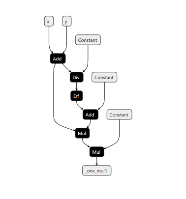

(heading-target-simple)=
# A Simple Example

An simple example demonstrating the usage of this functionality using the `GELU` activation function:

`GELU` activation function can be computed using a Gauss Error Function using the given formula:

```{math}
\text{GELU} = x\Phi(x) = x \cdot \frac{1}{2} [1 + \text{erf}(x / \sqrt{2})]
```

We will show how we can find a subgraph matching this computation and replace it by a call to the function.

Firstly, include all the rewriter relevant imports.

```python
from onnxscript.rewriter import pattern
from onnxscript import ir

```

Then create a target pattern that needs to be replaced using onnxscript operators.

```{literalinclude} examples/erfgelu.py
:pyobject: erf_gelu_pattern
```

After this, create a replacement pattern that consists of the GELU onnxscript operator.

```{literalinclude} examples/erfgelu.py
:pyobject: gelu
```
:::{note}
:name: type annotate ir.Value

The inputs to the replacement pattern are of type `ir.Value`. For detailed usage of `ir.Value` refer to the {py:class}`ir.Value <onnx_ir.Value>` class.
:::


For this example, we do not require a `match_condition` so that option is skipped for now. Then the rewrite rule is created using the `RewriteRule` function.

```python
rule = pattern.RewriteRule(
    erf_gelu_pattern,  # Target Pattern
    gelu,  # Replacement Pattern
)
```

It is more convenient to organize more complex rewrite-rules as a class. The above rule can be
alternatively expressed as below.

```{literalinclude} examples/erfgelu.py
:pyobject: ErfGeluFusion
```

The corresponding rewrite-rule can be obtained as below:

```python
erf_gelu_rule_from_class = ErfGeluFusion.rule()
```

Now that the rewrite rule has been created, the next step is to apply these pattern-based rewrite rules. The `rewriter.rewrite (model, pattern_rewrite_rules)` call applies the specified rewrite rules to the given model.

1. `model` : The original model on which the pattern rewrite rules are to be applied. This is of type `ir.Model` or `onnx.ModelProto`. If the model is an `ir.Model`, the rewriter applies the changes in-place, modifying the input model. If it is an `ModelProto`, the rewriter returns a new `ModelProto` representing the transformed model.
2. `pattern_rewrite_rules` : This parameter either a `Sequence[PatternRewriteRule]` or a `RewriteRuleSet`.

:::{note}
:name: pattern_rewrite_rules input formatting

For steps on how to create and use Rule-sets, refer to the example in the section [Creating a rule-set with different patterns](#heading-target-commute-ruleset).
:::

The snippet below below demonstrates how to use the `rewriter.rewrite` call for the rewrite rule created above:

```{literalinclude} examples/erfgelu.py
:pyobject: apply_rewrite
```

The graph (on the left) consists of the target pattern before the rewrite rule is applied. Once the rewrite rule is applied, the graph (on the right) shows that the target pattern has been successfully replaced by a GELU node as intended.

 
